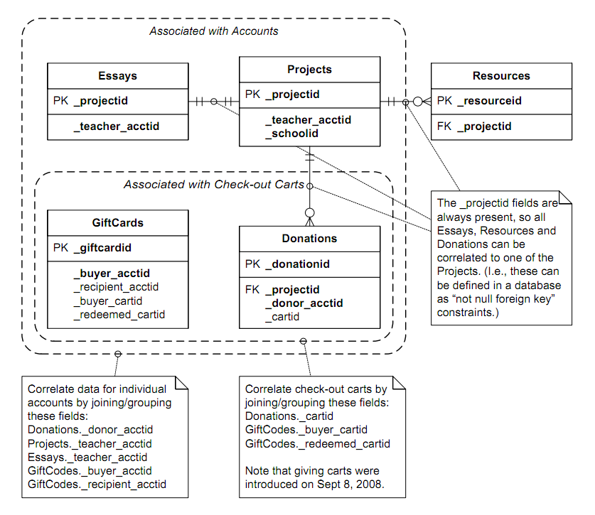

# Assignment 4: Final project plan

Patrick King

Professor Morgan

DATA 512

20 November 2018

## How Donors Choose

[DonorsChoose](https:www.donorschoose.org) is a crowd-sourced nonprofit organization that provides a platform for teachers to request funding for classroom supplies and projects. Donors can then peruse the advertised projects on the site, to choose which causes to support based on information garnered from the page created for each plea by the teacher or class. These "attractor" pages are standardized, containing uniform components such as classroom data, category of project, essays or short-form paragraphs. These page components cover how funds will be used, the financial targets, provide a status bar showing progress towards goal, and more. DonorsChoose has made public many years of its project data, tracking these attributes and donation results over many years. My project will statistically analyze the DonorsChoose public datasets to identify factors that result in more (or less) effective project funding request pages. 

I want to do this project to learn how teachers could improve the effectiveness of their crowdfunding efforts. I hope that trends and correlations can be shown that might help teachers attract more donations by creating their funding pages using the options and tactics that are associated with higher rates of project completion or higher rates of donation. I could share this information to teaching communities or discussion groups for feedback, which might help others better use crowdfunding through DonorsChoose to meet their classroom expense needs. 

The DonorsChoose approach to funding education expenses is a valuable alternative for teachers who often must use personal funds to equip their classrooms or to enable novel learning experiences. Helping teachers understand the effectiveness or shortcomings of various options in setting up, describing, and categorizing their projects might increase the rates of donation, or perhaps it might produce a "zero-sum" result where some teachers become more capable at attracting donations, essentially at the expense of the other teachers using less effective project designs. Finally, my motivations are not purely altruistic as first, I intend to share my analysis with my underfunded high school-teaching wife who often funds her ideas and classrooms from our savings, typically without reimbursement from her school district. "Charity begins at home..." (Browne, 141).

## Research Questions and Analysis

I intend to explore the data to find correlations (or lack thereof) in areas such as:

1. Do specific project types garner more funding than others?
2. Do specific class locations garner more funding than others?
3. Do specific giving page traits (such as "Thank you notes sent") garner more funding than others?

I expect that these questions and related ones will support traditions linear regression modelling and plotting, where I hope to be able to identify variables that have shown to be particularly successful or unsuccessful at attracting donations to projects. For example, given that a giving page must use pre-defined categories for primary_focus_subject (e.g. "Environmental Science"), some subjects might be better-funded than others. Perhaps certain donor regions (such as the Seattle area or San Francisco area) might support particular subjects ("Computer Science"), while others regions (such as Iowa from which I write this project plan) might better support different subjects ("Agricultural Science").

### Deliverables

I expect to use [Python]() in a [Jupyter Notebook](http://jupyter.org/) to load and explore the data from some combination of the below data source options, to be able to investigate my hypotheses, perhaps develop different hypotheses, and report meaningful correlations between project variables and outcomes such as primary_focus_subject="Art" results in goal reach and funding rates. The deliverable should be one IPYNB file, its supporting data CSV files, and any PNG files corresponding to generated visualizations, in a [Github](https://github.com/) repository parallel to this one. 

## Data Sourcess

DonorsChoose has made [thirteen years of its data](https://data.donorschoose.org/docs/overview/) open and publicly accessible for analysis. The data includes information that I have downloaded and begun analysis on:

* Projects (including classroom projects that have been posted, school information such as government-issued NCES ID, lat/long, and city/state/zip)
* Donations (including donation amounts, donor city, state)
* Project resources (including materials/resources requested for the classroom projects, including vendor name)
* Project essays (including the full text of the teacher-written requests accompanying all classroom projects)
* Giving pages (number of teachers, students, amount raised)

and more, such as gift card data, which I do not intend to use in my analysis.

### Option 1: Raw Data

Guidelines are provided to access the full set of all their available data in CSV form at the DonorsChoose [OpenData Layout and Docs page](https://research.donorschoose.org/t/opedata-layout-and-docs/18). The fields and schema of each data file is explicated there, including DonorsChoose-specific advice for interpreting the data and correcting for anomalies such as "A few years back, donor addresses became optional, even when the donor is eligible to receive a mailed thank-you packet from the classroom. So there are a lot of null address fields for donors who elected not to provide their address."

According to the documentation, "the data is compressed, quoted, escaped and without a header. To properly import, use Python's pandas using code in 'How to read this CSV file' under each button. No need to decompress files." Each data file comes in a compressed .GZ archive, which I've extracted using [WinZip for Windows,](https://www.winzip.com/win/en/) since Windows does not handle GZ archives natively.

To import the project data into Python pandas 235, for example, I should execute this command:

```python
projects = pandas.read_csv('opendata_projects000.gz', escapechar='\\', names=['_projectid', '_teacher_acctid', 
'_schoolid', 'school_ncesid', 'school_latitude', 'school_longitude', 'school_city', 'school_state', 'school_zip', 
'school_metro', 'school_district', 'school_county', 'school_charter', 'school_magnet', 'school_year_round', 
'school_nlns', 'school_kipp', 'school_charter_ready_promise', 'teacher_prefix', 'teacher_teach_for_america', 
'teacher_ny_teaching_fellow', 'primary_focus_subject', 'primary_focus_area' ,'secondary_focus_subject', 
'secondary_focus_area', 'resource_type', 'poverty_level', 'grade_level', 'vendor_shipping_charges', 'sales_tax', 
'payment_processing_charges', 'fulfillment_labor_materials', 'total_price_excluding_optional_support', 
'total_price_including_optional_support', 'students_reached', 'total_donations', 'num_donors', 
'eligible_double_your_impact_match', 'eligible_almost_home_match', 'funding_status', 'date_posted', 'date_completed', 'date_thank_you_packet_mailed', 'date_expiration'])
```

The DonorsChoose data site provides extensive documentation for the schemas of theses tables and guidelines for joining them as needed using [PostGreSQL,](https://www.postgresql.org/) according to this schema/ER diagram:



I expect to join and filter Projects, Donations and Resources to investigate my research questions. Since I'm not familiar with PostGreSQL this might end up being technically difficult, in which case I might fall back to option 2.

### Option 2: Filtered Data

The datasets have already been decompressed, joined, and filtered into significant subsets to produce [Looker](https://looker.com/) visualizations. Anyone can sign in to the DonorsChoose [exploration page](https://data.donorschoose.org/explore-our-impact/) to interact with the tools and visulazations there to answer many questions without coding. (Log in with email: opendata@donorschoose.org and password: teachersrock1.) 

Using the UI, one can filter on criteria such as location, subject, and other fields. Then, choose to download the pre-joined and filted data as a zip archive of CSV files, all pre-joined, with headers, and likely easier to process. For example, obtaining the data source for the Community Impact dashboard returns a zip archive named dashboard-donorschoose_org_community_impact_dashboard. Inside are a collections of CSV files tracking projects, dollars_raised, and so on. Depending upon the direction of my exploration, I might choose to download these more focused CSV files instead of the raw data discussed above, if I can filter them to produce the datasets I want to see. However, these dashboards are not based on all the DonorsChoose public data, rather only subsets that correspond to the visualizations they've pre-defined.

Schema of sample ashboardonorschoose_org_community_impact_dashboard all_projects.csv, with all data types as text:

|Column|Description|
|---|---|
|Teacher Name|Specified by giving page creator|
|School Name|Facility where project is located|
|Project Title|Descriptive name|
|Project Total Price|Estimated cost including optional support costs|
|Project Url|Giving page identifier from DonorsChoose site|
|Project Subject|Academic area of project|
|Project Grade Level|Age level of students|
|School State|Two-letter postal code|
|School County|Full location name|
|School City|Full location name|
|School District|Full district title of school|
|Project Completed Date|If not closed as unfunded|

If the pre-defined datasets are too limited, but the full open data is too unwieldy or complex for me to analyze, I am also considering obtaining specific data using DonorsChoose API.

### Option 3: API Data

DonorsChoose also makes its data available through a REST API with multiple endpoints:

* Donors: [<https://api.donorschoose.org/common/json-donor.html>](https://api.donorschoose.org/common/json-donor.html)
* Teachers: [<https://api.donorschoose.org/common/json-teacher.html>](https://api.donorschoose.org/common/json-teacher.html)
* Schools: [<https://api.donorschoose.org/common/json-school.html>](https://api.donorschoose.org/common/json-school.html)

Also, DonorsChoose provides additional APIs for partner pages to track their specific apps and interactions with DonorsChoose, and a transactions API with which one could make a donation to a project.

I could use these APIs to return JSON data subsets to investigate my research questions or supplement data if I find the Looker pre-filtered datasets too limited or scoped, or the raw datasets too tricky to manipulate. However, at this time I plan to try to perform my analyses by successfully loading the raw data into Python using Pandas as recommended in option 1, and processing it from there.

While all data is in text/CSV format, I expect to find anomolies in the data as guided by the DonorsChoose documentation, since they acknowledge that over the years they have modified the type of information they collect for each project. I expect some data to be incomplete and not always availalble.

## License Information

This DonorsChoose data is licensed under a Creative Commons Attribution-NonCommercial 3.0 Unported License ([CC BY-NC 3.0](https://creativecommons.org/licenses/by-nc/3.0/us/)). It is available for non-commercial use, and they provide these guidelines for commercial use: "If you'd like to use this data for commercial purposes, get in touch with us and tell us a bit about your plans. Our strong preference is to greenlight your commercial application with no licensing fees, and we have never charged for access to our API or data. We just need to make sure that the application won't run contrary to our org's mission, abuse the rich content that our teachers have created, etc" (DonorsChoose Data, Download Opendata License section).

## Additional Human Centered Data Science Considerations

Crowdfunding education is positioned by DonorsChoose founder Charles Best as a solution to tensions and financial strains teachers and budget directors conflict over: "We aren’t advocating for or against any program. We are going to create a platform that says very explicitly what it is that teachers experience in their classrooms. And donors from either side of the debate–or any part of the political spectrum–can decide whether they want to fund it or agitate to change the underlying conditions that created it.” Others, however, consider the "crowdfunding for schools" movement contrary to the "democratization" of decision making. Jeffrey Henig, a professor of political science and education at Teachers College, Columbia University, instead thinks “We have vested school boards, superintendents or mayors’ offices with authority to make decisions about schooling because we understand they will be made out in the open, where questions of conflicting values are negotiated and compromises are made...It will be a collective process embedded with democratic procedures and discussion.” Henig thinks sidstepping these democratic processes damage the groups DonorsChoose wants to help (Tyre). Yet others opine that that DonorsChoose de-incentivizes school districts and administrations from adequately funding classes, and the right approach is to dial back crowdfunding support to apply pressure to school administrators: "this is a reactive, piecemeal approach that can’t ever hope to fully address the needs of students, especially those in traditionally under-resourced schools. When successful, it also has the pernicious effect of convincing those controlling the purse-strings that traditional funding is unnecessary, leading to budget outlays that don’t allocate for buses, or paper, or computers on the tentative promise that Doreen from Atlanta, or James from Brooklyn will pay for it instead." (Karp)

Clearly, there will be some meaningful information to garner from the DonorsChoose data. Similar efforts specific to Donor Retention have already been studied (Althoff and Leskvec), but I know of and found no references to analyses of project traits or giving page metadata about donation attraction or success rates at reaching targets/completing goals, so I believe my work will be explore new facets of this data and hopefully, provide new insights about ways to attract donors to projects by using the levers available within the DonorsChoose platform.
  
Whether there is useful information to pass on to teachers to help them simply fund their needs, or whether my effort would only fuel competition in a competitive marketplace for funds causing those with access to such analyses to take funding away from other teachers who lack such tools is a good question. Or, even if I could disseminate good advice to all teachers equitably, would my doing so exacerbate problems by enabling teachers to ask for donations even more effectively, thus lessening pressure on school districts and administrations from adequately funding schools *without* relying upon donations? I don't know yet, but first I want to explore the data and see if I can produce at least some evidence that some tactics work better than others for teachers using DonorsChoose to supplement their budgets. 
  
## Works Cited

Althoff, Tim and Leskovec, Jure. "Donor Retention in Online Crowdfunding Communities: A Case Study of DonorsChoose.org." *ACM International Conference on World Wide Web (WWW)* 2015 [<https://cs.stanford.edu/people/jure/pubs/donors-www15.pdf>](https://cs.stanford.edu/people/jure/pubs/donors-www15.pdf).

Browne, Thomas. *Religio Medici : The Religion of a Doctor.* Sir Thomas Browne site: University of Chicago. Web. 21 November 2018 [<http://penelope.uchicago.edu/relmed/relmed1645.pdf>](http://penelope.uchicago.edu/relmed/relmed1645.pdf).

DonorsChoose Data. "Download Data". Web. 21 November 2018 [<https://research.donorschoose.org/t/download-opendata>](https://research.donorschoose.org/t/download-opendata)

Karp, Jonathan. "Want to Keep School Funding Alive? Put an End to DonorsChoose" *Mic* 11 July 2013: n-pag. Web. 21 November 2018 [<https://mic.com/articles/54021/want-to-keep-school-funding-alive-put-an-end-to-donorschoose>](https://mic.com/articles/54021/want-to-keep-school-funding-alive-put-an-end-to-donorschoose#.vCXQjvABc).

Tyre, Peg. "Beyond School Supplies: How DonorsChoose is Crowdsourcing Real Education Reform." *FastCompany* 2 October 2014: n.
pag. Web. 21 November 2018 [<https://www.fastcompany.com/3025597/donorschoose-hot-for-teachers>](https://www.fastcompany.com/3025597/donorschoose-hot-for-teachers).
